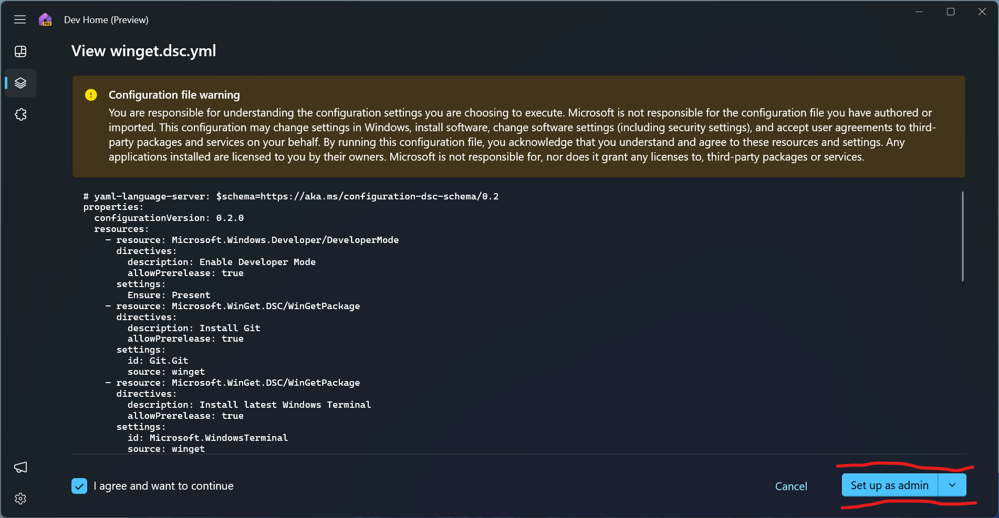
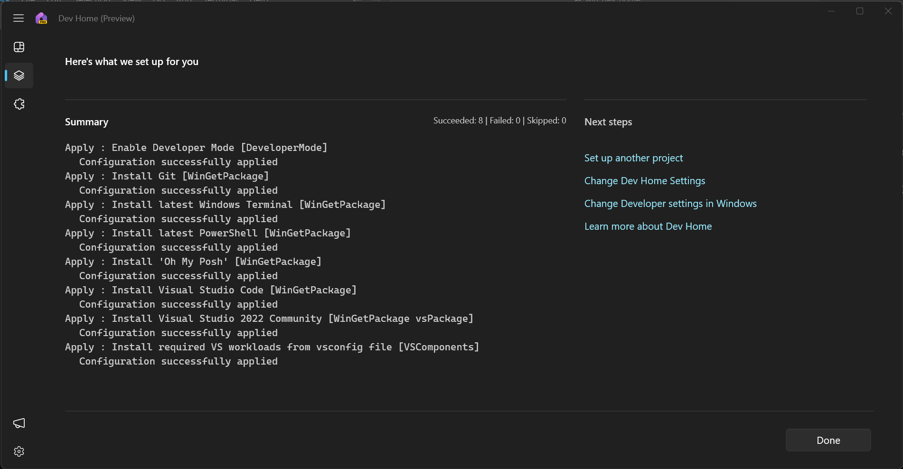

# Windows Dev Home Configuration Files

[Windows Dev Home](https://learn.microsoft.com/en-us/windows/dev-home/) is a new control center for Windows providing the ability to monitor projects in your dashboard using customizable widgets, set up your dev environment by downloading apps, packages, or repositories, connect to your developer accounts and tools (such as GitHub), and create a Dev Drive for storage all in one place.

These are configuration files for a [Windows Dev Home](https://learn.microsoft.com/en-us/windows/dev-home/) environment targeted at developing Windows desktop applications using [.Net](https://dotnet.microsoft.com/en-us/learn/dotnet/what-is-dotnet), the [Windows App SDK](https://learn.microsoft.com/en-us/windows/apps/windows-app-sdk/) and [WinUI 3](https://learn.microsoft.com/en-us/windows/apps/winui/).

* The primary language is [C#](https://learn.microsoft.com/en-us/dotnet/csharp/tour-of-csharp/).
* [Git](https://git-scm.com/) is the SCM of choice.
* [Windows Terminal](https://github.com/microsoft/terminal) and [PowerShell](https://learn.microsoft.com/en-us/powershell/) customized with [Oh My Posh](https://ohmyposh.dev/) for command line opeartions.
* [Visual Studio Community Edition](https://visualstudio.microsoft.com/vs/community/) for the IDE, although [VSCode](https://code.visualstudio.com/) is also installed mainly for a lighter code/file editor.

# Setting Up the Dev Home

## Command Line (Run as Administrator)

```powershell
winget configure <path to the .yml file>/winget.dsc.yml
```
  
## Use Dev Home App

1. Go to 'Dev Home' -> 'Machine configuration' and Select the configuration file,

.

2. Click 'Setup as admin' and wait for the configuration to be applied. Once completed, you should show a status screen similar to the one below.

.

# Recommended Visual Studio Extensions

* [Rewrap](https://marketplace.visualstudio.com/items?itemName=stkb.Rewrap-18980)
* [Editor Guidelines](https://marketplace.visualstudio.com/items?itemName=PaulHarrington.EditorGuidelinesPreview)
* [Template Studio for WinUI](https://marketplace.visualstudio.com/items?itemName=TemplateStudio.TemplateStudioForWinUICs)
